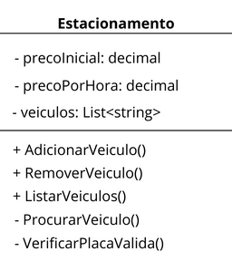

# DIO - Trilha .NET - Fundamentos
www.dio.me

## Desafio de projeto
Para este desafio, você precisará usar seus conhecimentos adquiridos no módulo de fundamentos, da trilha .NET da DIO.

## Contexto
Você foi contratado para construir um sistema para um estacionamento, que será usado para gerenciar os veículos estacionados e realizar suas operações, como por exemplo adicionar um veículo, remover um veículo (e exibir o valor cobrado durante o período) e listar os veículos.

## Proposta
Você precisará construir uma classe chamada "Estacionamento", conforme o diagrama abaixo:

A classe contém três variáveis, sendo:

**precoInicial**: Tipo decimal. É o preço cobrado para deixar seu veículo estacionado.

**precoPorHora**: Tipo decimal. É o preço por hora que o veículo permanecer estacionado.

**veiculos**: É uma lista de string, representando uma coleção de veículos estacionados. Contém apenas a placa do veículo.

A classe contém três métodos, sendo:

**AdicionarVeiculo**: Método responsável por receber uma placa digitada pelo usuário e guardar na variável **veiculos**.

**RemoverVeiculo**: Método responsável por verificar se um determinado veículo está estacionado, e caso positivo, irá pedir a quantidade de horas que ele permaneceu no estacionamento. Após isso, realiza o seguinte cálculo: **precoInicial** * **precoPorHora**, exibindo para o usuário.

**ListarVeiculos**: Lista todos os veículos presentes atualmente no estacionamento. Caso não haja nenhum, exibir a mensagem "Não há veículos estacionados".

Por último, deverá ser feito um menu interativo com as seguintes ações implementadas:
1. Cadastrar veículo
2. Remover veículo
3. Listar veículos
4. Encerrar

## Solução
O código está pela metade, e você deverá dar continuidade obedecendo as regras descritas acima, para que no final, tenhamos um programa funcional. Procure pela palavra comentada "TODO" no código, em seguida, implemente conforme as regras acima.

Descrição projeto:
O projeto apresenta um sistema robusto de gerenciamento de estacionamento. A classe Estacionamento oferece funcionalidades para adicionar, remover e listar veículos, além de calcular o valor a ser cobrado, considerando o tempo de permanência de cada veículo. As validações implementadas garantem a aceitação apenas de placas válidas no padrão Mercosul, embora ainda não verifique se a placa realmente existe, um aspecto para aprimoramento futuro. A aplicação mantém um controle eficiente do registro de veículos estacionados. Com uma interface interativa via console, os usuários têm acesso a operações como adicionar um veículo ao estacionamento, remover veículos, listar os veículos atualmente estacionados e calcular o valor a pagar com base no tempo de permanência de cada veículo.

Diagrama novo modelo da classe Estacionamento abaixo:

**OBS:** Não é permitido o cadastro de mais de um veículo com a mesma placa.

## Referencias
[Link padrão placa Mercosul utilizada no código](https://www.detran.ce.gov.br/esclareca-suas-duvidas-sobre-a-placa-padrao-mercosul/#:~:text=A%20nova%20placa%20padrão%20Mercosul,ponta%20esquerda%20da%20mesma%20faixa.)

Exemplo utilização cadastro placa de veículo
- BRA2E19
- BEE4R22
- FJB4E12

